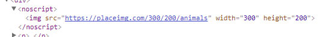

# React 16 `<noscript>` Testing

Basic project to test React `16.1.0-beta` and use of the `<noscript>` tag. Requested by [Dan Abramov](https://github.com/gaearon) via [Github issue 11423](https://github.com/facebook/react/issues/11423#issuecomment-341667066).

## Issue

When using Server-Side Rendering (SSR) and a `<noscript>` tag in a components render method, the following warning is displayed in the console:

> Warning: Expected server HTML to contain a matching &lt;img&gt; in &lt;noscript&gt;.

HTML from the SSR (view -> source):

```html
<noscript>
  
</noscript>
```

HTML from Chrome DevTools:



## Notes

- babel config from `package.json`
- babel compiles to `/dist` folder
- webpack spits out client js to `/public` folder

## Run

- `npm install`
- `npm run build` (babel + webpack)
- `npm start`
- Visit: `http://localhost:8500/`

Stephen Last

2017-11-03
